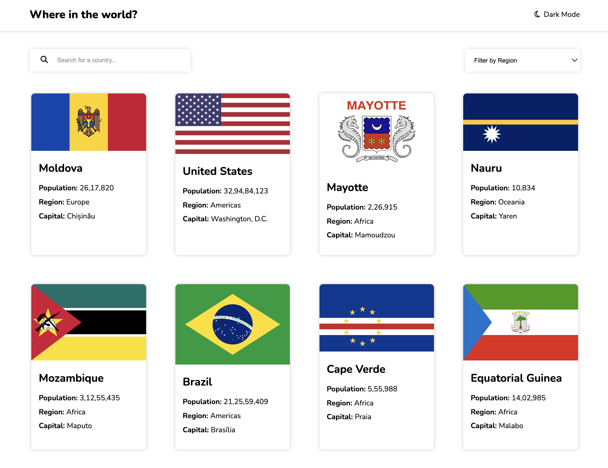

# REST Countries API with Color Theme Switcher

This project is a solution to the [REST Countries API with Color Theme Switcher and Dark Mode challenge](https://www.frontendmentor.io/challenges/rest-countries-api-with-color-theme-switcher-5cacc469fec04111f7b848ca) from Frontend Mentor.

## Table of Contents

- [Overview](#overview)
  - [The Challenge](#the-challenge)
  - [Screenshot](#screenshot)
- [Demo](#demo)
- [Features](#features)
- [Technologies Used](#technologies-used)
- [Setup](#setup)
- [Usage](#usage)
- [Contributing](#contributing)
- [License](#license)

## Overview

### The Challenge

The challenge is to integrate with the [REST Countries API](https://restcountries.com/v3.1/all) to pull country data and display it as per the provided designs. Users should be able to interact with the interface by searching for countries, filtering by region, viewing detailed information, and toggling between light and dark mode.

### Screenshot



## Demo

You can view the live demo [here](https://countries-api-js.vercel.app/).

## Features

- Display all countries from the REST Countries API
- Search for a specific country using an input field
- Filter countries by region
- View detailed information about a country on a separate page
- Click through to see border countries' details
- Toggle between light and dark mode color schemes
- Responsive design for optimal layout on various devices

## Technologies Used

- HTML5
- CSS3 (with SCSS)
- JavaScript (ES6+)
- React
- Parcel
- LocalStorage (for storing theme preference)
- Git and GitHub (version control and deployment)

## Setup

1. Clone the repository:
   ```bash
   git clone https://github.com/pranav-k-jha/countries-api.git
   ```
2. Navigate to the project directory:
   `cd rest-countries-api`

3. Install dependencies:
   `npm install`
4. Run the development server:
   `npm start`
5. Open your browser and visit `http://localhost:3000` to view the app.

## Usage

- On the homepage, you can see all countries from the REST Countries API.
- Use the search input field to find a specific country by name.
- Filter countries by region using the dropdown menu.
- Click on a country to view more detailed information on a separate page.
- On the detail page, click on the border countries to see their details.
- Toggle between light and dark mode using the theme switcher button.

## License

This project is licensed under the MIT License.
